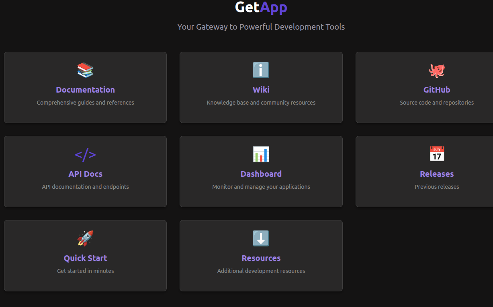

# GetApp Site

A customizable landing page inspired by GetApp, featuring configurable boxes that can be managed via environment variables or a YAML file.



## Table of Contents
- [Features](#features)
- [Quick Start](#quick-start)
- [Configuration](#configuration)
  - [YAML Configuration](#yaml-configuration)
  - [Environment Variables](#environment-variables)
- [Logo Options](#logo-options)
  - [Emoji Icons](#emoji-icons)
  - [Font Awesome Icons](#font-awesome-icons)
  - [SVG and Image URLs](#svg-and-image-urls)
- [Customization](#customization)
- [Deployment Options](#deployment-options)
  - [Standard Deployment](#standard-deployment)
  - [Docker Deployment](#docker-deployment)
  - [Kubernetes Deployment](#kubernetes-deployment)
- [License](#license)

## Features

- Modern, responsive design with dark theme support
- Configurable boxes with logos, titles, descriptions, and links
- Multiple logo options: emoji, Font Awesome icons, SVG, and image URLs
- Custom styling for individual boxes
- Adjustable grid layout (1-4 columns)
- Configuration via YAML file or environment variables
- Server-side rendering with Next.js
- Fully dockerized for easy deployment
- Kubernetes deployment ready

## Quick Start

### Standard Installation

```bash
# Clone the repository
git clone https://github.com/yourusername/getapp-site-cts.git
cd getapp-site-cts

# Install dependencies
npm install

# Run the development server
npm run dev

# Access at http://localhost:3000
```

### Docker Quick Start

```bash
# Clone the repository
git clone https://github.com/yourusername/getapp-site-cts.git
cd getapp-site-cts

# Start with Docker Compose
docker-compose up -d

# Access at http://localhost:3000
```

## Configuration

The site can be configured in two ways:

1. **YAML Configuration (Recommended)**: Edit the `boxes.yaml` file in the root directory
2. **Environment Variables**: Set environment variables as shown in `.env.example`

YAML configuration takes precedence over environment variables.

### YAML Configuration

Edit the `boxes.yaml` file to add, remove, or modify boxes:

```yaml
# Site title (plain text)
title: "GetApp"
# Site subtitle
subtitle: "Your Gateway to Powerful Development Tools"
# Optional HTML title (will override the plain text title if provided)
titleHtml: "<span class='text-light-a0'>Get</span><span class='text-primary-light'>App</span>"
# Number of columns in the grid (1-4)
columns: 3
boxes:
  - logo: "📚"  # Emoji, SVG icon, or image URL
    title: "Documentation"
    description: "Comprehensive guides and references"
    link: "/docs"
    customClass: "bg-tonal-100"  # Optional custom CSS class
  # Add more boxes as needed
```

### Environment Variables

Copy `.env.example` to `.env` and customize the variables:

```
# Site Configuration
SITE_TITLE=GetApp
SITE_SUBTITLE=Your Gateway to Powerful Development Tools
SITE_TITLE_HTML=<span class='text-light-a0'>Get</span><span class='text-primary-light'>App</span>
SITE_COLUMNS=3

# Box 1
BOX_1_LOGO=📚
BOX_1_TITLE=Documentation
BOX_1_DESCRIPTION=Comprehensive guides and references
BOX_1_LINK=/docs
BOX_1_CUSTOM_CLASS=bg-tonal-100
```

## Logo Options

### Emoji Icons

Use emoji icons for a simple and effective approach:

```yaml
logo: "📚"  # In YAML
```

```
BOX_1_LOGO=📚  # In environment variables
```

### Font Awesome Icons

Use the format `fa:icon-name`, `fab:icon-name`, or `far:icon-name`:

```yaml
logo: "fa:book"      # Solid style
logo: "fab:github"   # Brand style
logo: "far:calendar"  # Regular style
```

### SVG and Image URLs

```yaml
# SVG Icons
logo: '<svg xmlns="http://www.w3.org/2000/svg" viewBox="0 0 24 24">...</svg>'

# Image URLs
logo: 'https://example.com/image.png'
```

## Customization

- **Styling**: Edit `tailwind.config.js` and `styles/globals.css`
- **Dark Theme**: Customize colors in `styles/dark-theme.css`
- **Layout**: Adjust columns using the `columns` property
- **Individual Boxes**: Add custom CSS classes using the `customClass` property

## Deployment Options

### Standard Deployment

```bash
# Build for production
npm run build

# Start the production server
npm start
```

### Docker Deployment

#### Using Docker Compose (Recommended)

```bash
# Build and start in detached mode
docker-compose up -d

# View logs
docker-compose logs -f

# Stop the container
docker-compose down
```

#### Using Docker Directly

```bash
# Build the image
docker build -t getapp-site .

# Run the container
docker run -p 3000:3000 -v $(pwd)/boxes.yaml:/app/boxes.yaml -v $(pwd)/.env:/app/.env getapp-site
```

### Kubernetes Deployment

The application includes Kubernetes manifests in the `k8s` directory:

```bash
# Apply all resources
kubectl apply -k k8s/

# Check deployment status
kubectl get pods -l app=getapp-site
```

The Kubernetes setup includes:
- ConfigMap for the boxes.yaml configuration
- Deployment with 2 replicas
- Service for internal access
- Ingress for external access

## License

MIT
